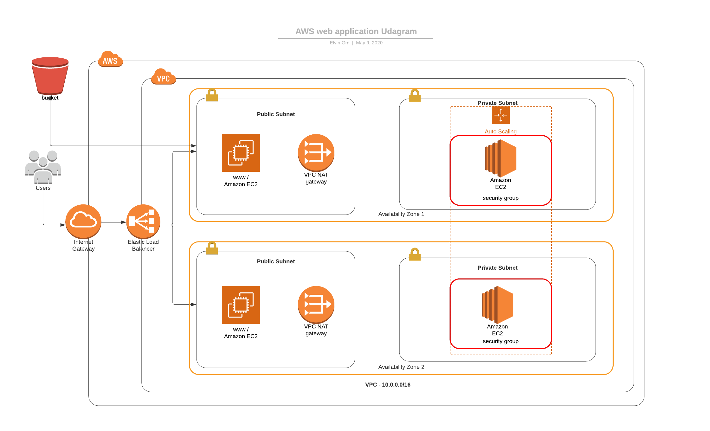

# Deploy a high-availability application using CloudFormation.

This project consists of the assets required to deploy a web application to Amazon Web Services (AWS).

## Project-Specific Requirements

-   2x Availability Zones (AZ)
-   1x public, 1x private Subnet per AZ
-   4x Auto-Scaled instances of Ubuntu 18 LTS located in private subnets listening on TCP port 80 proxied by Elastic Load Balancer (ELB)
-   ELB located in public subnets listening on TCP port 80

## CloudFormation

There are 2 configuration files, one for the network architecture and one for the server deployment, both with corresponding parameter files:

-   [network.yml](network.yml)
    -   [network-params.json](network-params.json)
-   [servers.yml](servers.yml)
    -   [server-params.json](server-params.json)

The CLI commands used to create both stacks, in order:

```
./create-iac.sh ha-webapp-servers servers.yml servers-params.json

./create-iac.sh ha-webapp-servers servers.yml servers-params.json
```

If you want to perform and update use:

```
./update.sh
```

**Network Diagram:**

